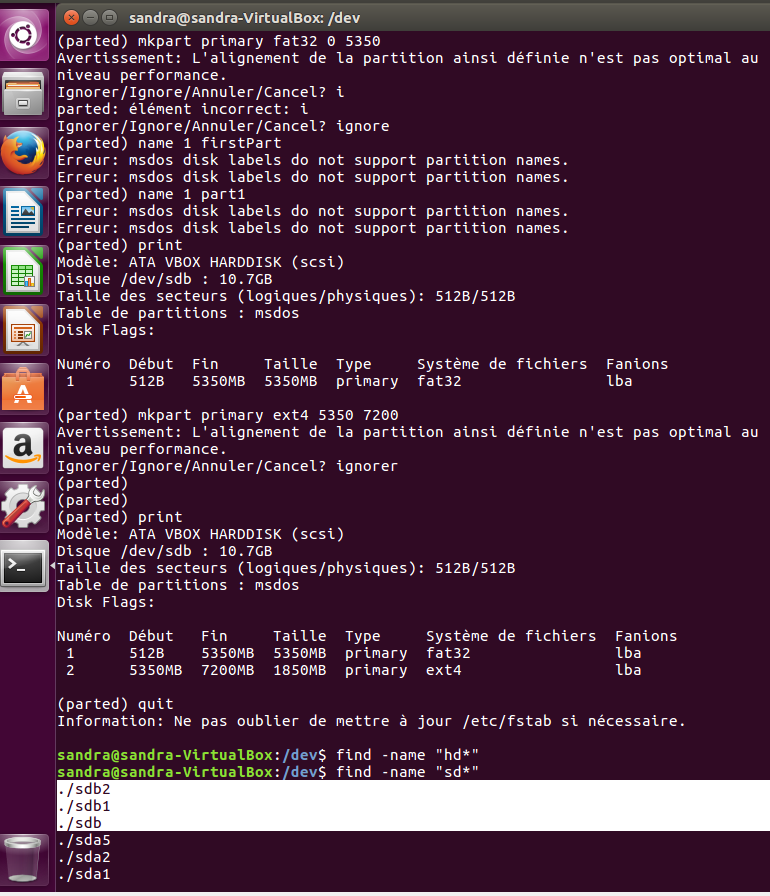
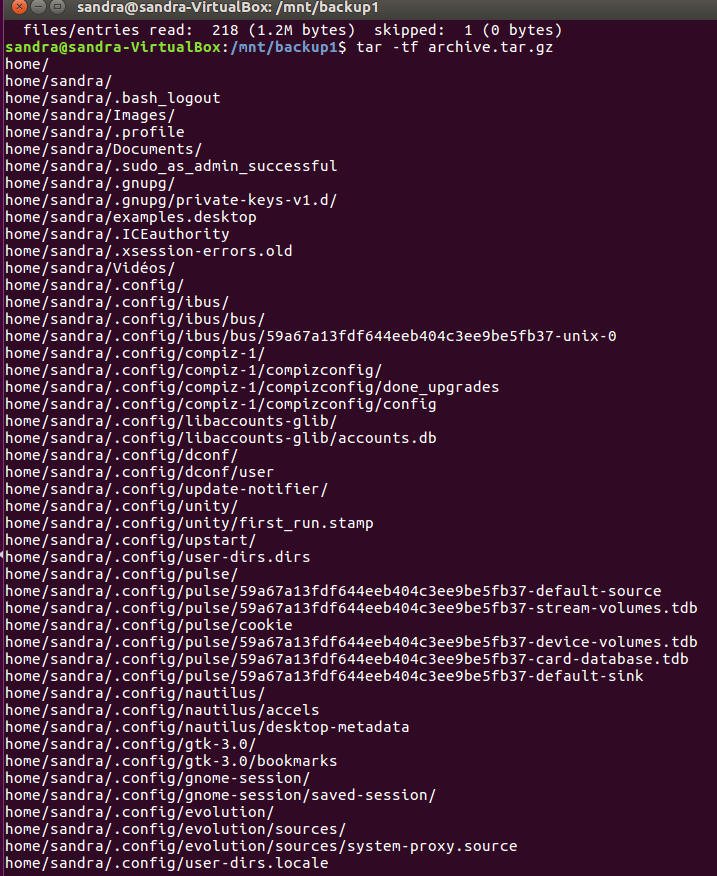
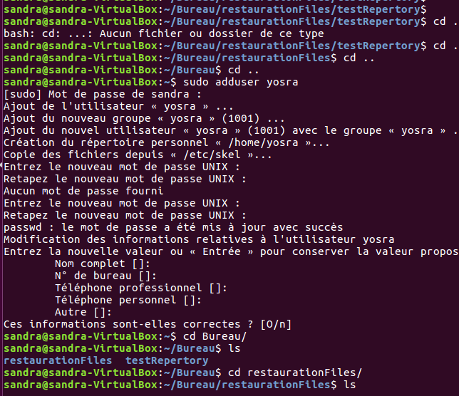
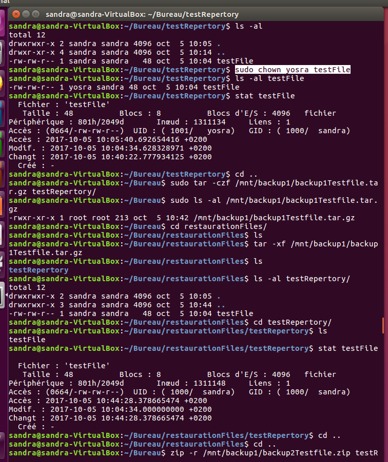

# LABORATOIRE 01 - LINUX BACKUP

Dans ce laboratoire nous nous intéressons à la sauvegarde externe en utilisant le disque dur. Pour cela nous allons utilisé une machine virtuelle linux dont Ubuntu 16.04 LTS pour gérer la sauvegarde et restauration de données aux travers des commandes `ZIP` et `TAR`. 

## ETUDIANTS 

* HARBAOUI Yosra
* DONGMO NGOUMNAI Annie Sandra

## TABLE DES MATIERES 
1. [Tâche 1: Préparation du disque de sauvegarde](#t%C3%82che-1-preparation-du-disque-de-sauvegarde)
2. [Tâche 2: Test de sauvegarde en utilisant ZIP et TAR](#t%C3%82che-2-test-de-sauvegarde-en-utilisant-zip-et-tar)
3. [Tâche 3: Sauvegarde des fichiers de metadonnées](#t%C3%82che-3-sauvegarde-des-fichiers-de-metadonnees)
4. [Tâche 4: Liens physique et symboliques](#t%C3%82che-4-liens-physique-et-symboliques)

## TÂCHE 1: PREPARATION DU DISQUE DE SAUVEGARDE
Dans cette tâche et toutes les autres tâches nous allons utilisé un disque dur virtuelle comme disque dur de sauvegarde. 
1. Tout d'abord nous allons visualiser les différentes partitions de disques dur visibles dans notre machine virtuelle en recherchant les fichiers suivant `/dev/sda*` et `/dev/hd*` existant en utilisant la commande `find` comme suit :

Ensuite et fin visualiser les partions qui sont montées à l'aide de la commande `mount` comme suit : 

On remarque que de toutes les 4 partions existantes il n'y a qu'une seule qui est montée la 1ère `sda1`. Ce qui est normale car on vera dans la suite que notre machine a 2 disques vides inutilisées (qui correspondent aux 2 autres partitions). 

2. Après analyse des partitions de disque visible dans notre machine nous  allons rattaché à notre machine le disque dur `win7`d'une machine virtuel windows crée au préalable avec les caractéristiques suivantes: 

Après l'avoir attaché nous allons de nouveau consulter les partitions visibles dans notre machine. On obtient de nouvelles partitions `sdb` ayant la même structure que celle vu précedement (voire selection image suivante): 
;
 Ce sont les partitions de notre disque dur virtuel attaché!! :)
 
3. Nous allons maintenant utiliser la commande `parted` pour visualiser les caracteristiques, partitionner notre disque dur attaché (en 2 parties égales). Ainsi après utilisation de la commande `parted sdb` et `print` pour visualiser les partitions du disque de sauvegarde et leur caractéristiques on obtient : 
 ;
 
 Ensuite nous utilisons la commande `mktable` pour créer une nouvelle table de partition `msdos` avec `MBR`(secteur bootable) écrasant celle qui existait déjà comme suit: 
 ;
 Nous obtenons ainsi 10.7GB de taille disponible du disque de sauvegarde à l'aide de la commande `print free`
 
 Enfin nous créons 2 partitions égales avec l'espace disponible à l'aide de la commande `mkpart`
 La 1ère étant primaire, avec système fichier de type fat32 , commençant à 0 et finissant à 5350 MB à l'aide la commande `mkpart fat32 0 5350`. La 2ème primaire, avec système fichier de type ext4, commençant à 5350 et finnissant à 7010MB à l'aide de la commande suivante `mkpart ext4 5350 1070`. Ainsi après vérification on obtient 2 partitions égales 
 ;
 
 4. Nous passons au formattage des partitions crées ä l'aide des commandes `sudo mkfs -t vfat ./sdb1 ` et `sudo mkfs -t vfat ./sdb2`: 
 ;
 
 5. Ici nous avons crée 2 dossiers `backup1`et `backup2` puis monter les 2 partitions du disque dans ces dossiers avec les commandes suivantes `sudo mount /dev/sdb1 backup1` et `sudo mount /dev/sdb2 backup2`
 ;
 
 6. Nous visualisons maintenant la taille disponible dans les disques avec les commandes `df -h backup1` et `df -h backup2`
 ;

## TÂCHE 2: TEST DE SAUVEGARDE EN UTILISANT ZIP ET TAR
Dans cette partie nous allons utiliser `ZIP` et `TAR` pour faire la sauvegarde et restauration du repertoire `/home`. La sauvegarde s'effectuera dans le disque de Backup1 vfat32 (partition crée précedement mise dans le repertoire /backup1) tandis que la restauration s'éffectuera dans le repertoire `/tmp`.

-> sauvegarde de `/home` dans le repertoire (disque de sauvegarde) `/backup1` à l'aide de la commande `tar -czf archive.tar.gz /home`
et `zip -r archives.zip /home` cela en se placant dans le repertoire `/backup1`.
;

-> listing des fichiers sauvegarder  à l'aide des commandes `tar -tf archive.tar.gz` et `unzip -l archives.zip`
;
;
;

-> restauration des fichiers dans le repertoire `/tmp` à l'aide des commandes `tar -xf archive.tar.gz` et `unzip -l archives.zip`
;
;

-> Sauvegarde incremental depuis le  `September 23, 2016, 10:42:33` en utlisant la commande `tar`: ainsi nous avons utilisé la commande find pour recherche les fichiers modifier depuis la date donée jusque la date du 05 octobre 2017 ensuite nous avons utiliser un pipe pour récupérée cette sortie et l'envoyer à l'entrée de la commande TAR qui effectuera la sauvegarde. `find /home -mtime $(date +%s -d"Oct 5, 2017 09:42:25" ) -mtime $(date +%s -d"Sep 23, 2016 10:42:33") | sudo tar cz -T - -f incrementalBackup1.tar.gz`. 
;

## TÂCHE 3: SAUVEGARDE DES FICHIERS DE METADONNEES

Dans cette tâche nous allons annalysé les métadonnées des fichiers après une sauvegarde et restauration de ceux ci à l'aide des commandes `ZIP` et `TAR`.
Tout d'abord nous allons crée un repertoire nommé `/testRepertory` avec la commande `mkdir /testRepertory` dans lequel nous créons un fichier `testFile` (propriétaire `sandra`) avec la commande `touch testFile`. Ensuite, nous avons crée un nouvel utilisateur `yosra` à l'aide de la commande `sudo adduser yosra` comme suit : 
;
;
 Puis nous avons modifier le propriétaire du fichier (qui était `sandra`) en `yosra`crée précedement, effectuer une sauvegarde et restauration avec la commande tar comme suit (voire capture): 
;
 On remarque qu'il n'y a aucun changement au niveau de la date de dernière modification et des permissions mais le propriétaire du fichier restaurer est devenu celui du repertoire de restauration `restaurationFiles`.
 
 Après une sauvegarde et une restauration avec la commande `ZIP` comme suit : 
 ;
  On remarque qu'il n'y a aucun changement au niveau de la date de dernière modification et des permissions mais le propriétaire du fichier restaurer est devenu celui du repertoire de sauvegarde `/backup1`. 

## TÂCHE 4: LIENS PHYSIQUE ET SYMBOLIQUES

Dans cette partie nous allons analyser les liens physiques et symboliques après une sauvergarde et restauration de certains fichiers. Pour cela nous allons créer un repertoire dans lequel on créera un fichier `testFile1` avec un lien symbolique `fileSymb` , puis un autre fichier `testFile2`avec un lien physique `fileHard`.
 ;
 
 Après une sauvegarde et une restauration avec la commande `tar` comme suit : 
  ;
 on remarque que les liens Symbolique et physiques sont toujours présent
 
 Après une sauvegarde et une restauration avec la commande `zip` comme suit : 
  ;
 on remarque que les liens Symbolique et physiques ont disparus

