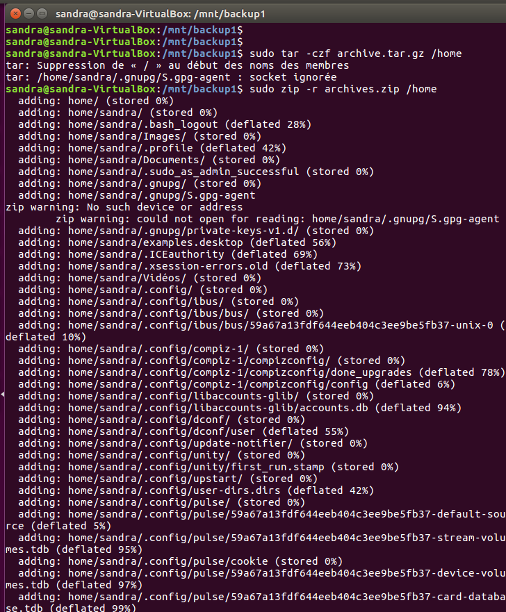
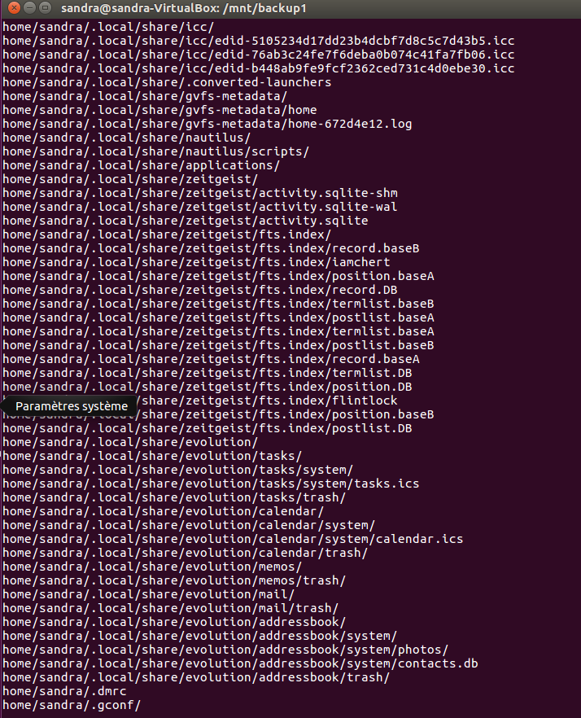
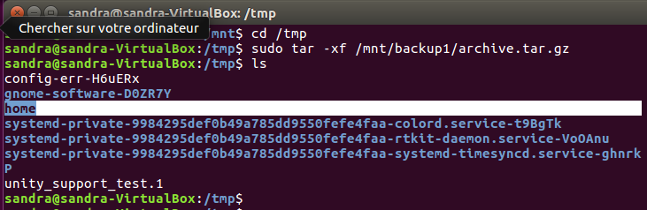
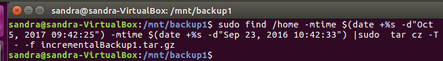
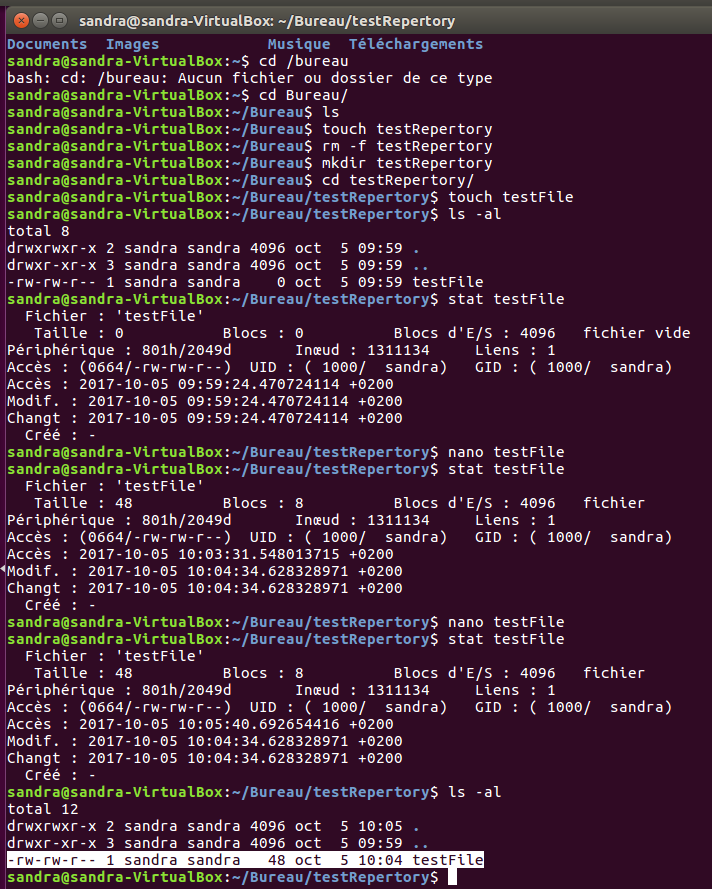
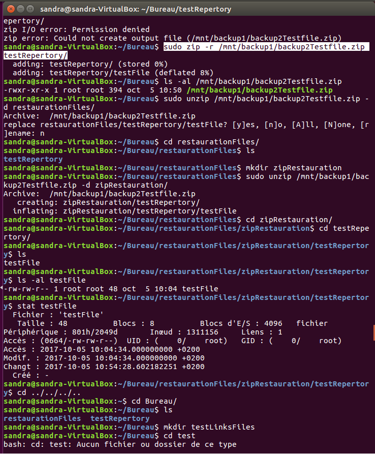

# LABORATOIRE 01 - LINUX BACKUP

Dans ce laboratoire nous nous intéressons à la sauvegarde externe en utilisant un disque dur externe. Pour cela nous allons utiliser une machine virtuelle linux soit Ubuntu 16.04 LTS. A fin de gérer la sauvegarde et la restauration des données, nous allons utilisé les commandes `ZIP` et `TAR`.

## ETUDIANTS

* HARBAOUI Yosra
* DONGMO NGOUMNAI Annie Sandra

## TABLE DES MATIERES
1. [Tâche 1: Préparation du disque de sauvegarde](#t%C3%82che-1-preparation-du-disque-de-sauvegarde)
2. [Tâche 2: Test de sauvegarde en utilisant ZIP et TAR](#t%C3%82che-2-test-de-sauvegarde-en-utilisant-zip-et-tar)
3. [Tâche 3: Sauvegarde des fichiers de metadonnées](#t%C3%82che-3-sauvegarde-des-fichiers-de-metadonnees)
4. [Tâche 4: Liens physique et symboliques](#t%C3%82che-4-liens-physique-et-symboliques)

## TÂCHE 1: PREPARATION DU DISQUE DE SAUVEGARDE
Dans tout le long du labo, nous allons utiliser un disque dur virtuelle comme disque dur de sauvegarde.
1. Tout d'abord, nous allons visualiser les différentes partitions visibles du disque dur dans notre machine virtuelle en recherchant les fichiers suivant `/dev/sd*` et `/dev/hd*` existant en utilisant les commandes suivantes:  

 `find -name "hd*"` et `find -name "sd*"`  

 La figure suivante montre les résultats obtenus.    

  Ensuite, à fin de visualiser les partitions qui sont montées, nous avons utilisés la commande `mount` comme suit :

 

 Nous remarquons que, parmi les 3 partitions existantes, il n'y a qu'une seule qui est montée soit la 1ère **sda1**.

2. Après analyse des partitions visibles du disque de notre machine, nous allons rattacher à celle ci le disque dur virtuel **win7** d'une machine virtuelle Windows créée au préalable avec les caractéristiques suivantes:  

   

 Après cette manipulation, nous allons, de nouveau, consulter les partitions visibles dans notre machine. Nous obtenons une nouvelle partition `sdb` comme le montre la figure suivante:  

   

 C'est notre disque dur virtuel rattaché!!

3. Nous allons, maintenant, utiliser la commande `parted` pour visualiser les caractéristiques, et partitionner notre disque dur rattaché (en 2 parties égales).  
Après utilisation de la commande `parted sdb` et `print` pour visualiser les partitions du disque de sauvegarde et leur caractéristiques, nous obtenons :  

   

 Ensuite, nous utilisons la commande `mktable` pour créer une nouvelle table de partition **msdos** avec **MBR** (secteur bootable) écrasant celle qui existait déjà, comme suit:  

   

 Nous obtenons ainsi **26.8GB** de taille disponible de sauvegarde du disque à l'aide de la commande `print free`.  

   

 Enfin, nous créons 2 partitions égales en partageant l'espace disponible à l'aide de la commande `mkpart`.  
 La première, étant primaire, avec un système fichier de type **fat32** , commençant à **0** et finissant à **1340 MB** à l'aide la commande `mkpart fat32 0 1340`. La deuxème primaire, avec un système fichier de type **ext4**, commençant à **1340 MB** et finnissant à **2680 MB** à l'aide de la commande suivante:  `mkpart ext4 5350 1070`. Ainsi, après vérification nous obtenons 2 partitions égales.  

   

 Afin de vérifier la taille et l'espace  disponible dans chaque patitions, nous avons visualisé les 2 partitions égales du disque à l'aide de la commande `print free`.  

 

4. Nous passons au formattage des partitions crées à l'aide des commandes `sudo mkfs -t vfat ./sdb1 ` et `sudo mkfs -t vfat ./sdb2`:  

  

5. Nous avons créer 2 dossiers `backup1`et `backup2` puis monter les 2 partitions du disque dans ces dossiers avec les commandes suivantes: `sudo mount /dev/sdb1 backup1` et `sudo mount /dev/sdb2 backup2`  

  ;

6. Nous visualisons maintenant l'espace disponible dans les disques avec les commandes `df -h backup1` et `df -h backup2`.  

 ;

## TÂCHE 2: TEST DE SAUVEGARDE EN UTILISANT ZIP ET TAR
Dans cette partie, nous allons utiliser `ZIP` et `TAR` pour faire la sauvegarde et restauration du repertoire `/home`. La sauvegarde s'effectuera dans le disque de **Backup1 vfat32** (partition crée précedement mise dans le repertoire **/backup1**) tandis que la restauration s'éffectuera dans le repertoire **/tmp**.

-> sauvegarde de **/home** dans le repertoire (disque de sauvegarde) **/backup1** à l'aide de la commande `tar -czf archive.tar.gz /home` et `zip -r archives.zip /home`, tout en étant dans le repertoire **/backup1**.  

-> listing des fichiers sauvegardés  à l'aide des commandes `tar -tf archive.tar.gz` et `unzip -l archives.zip`.  

  

  

-> restauration des fichiers dans le repertoire **/tmp** à l'aide des commandes `tar -xf archive.tar.gz` et `unzip -l archives.zip`.  

  

-> Sauvegarde incremental depuis le  **September 23, 2016, 10:42:33** en utlisant la commande `tar`. Tout d'abord, nous avons utilisé la commande `find` pour rechercher les fichiers modifiés depuis la date donnée jusque la date du 05 octobre 2017. Ensuite, nous avons utilisé un pipe pour récupérer cette sortie et l'envoyer à l'entrée de la commande `tar` qui effectuera la sauvegarde.  
`find /home -mtime $(date +%s -d"Oct 5, 2017 09:42:25" ) -mtime $(date +%s -d"Sep 23, 2016 10:42:33") | sudo tar cz -T - -f incrementalBackup1.tar.gz`.  

;

## TÂCHE 3: SAUVEGARDE DES FICHIERS DE METADONNEES

Dans cette partie, nous allons annalyser les métadonnées des fichiers après une sauvegarde et restauration de ceux-ci à l'aide des commandes `ZIP` et `TAR`.  
Tout d'abord nous allons créer un repertoire nommé **/testRepertory** avec la commande `mkdir /testRepertory` dans lequel nous créons un fichier **testFile** (propriétaire **sandra**) avec la commande `touch testFile`. Ensuite, nous avons créer un nouvel utilisateur **yosra** à l'aide de la commande `sudo adduser yosra` comme suit :

  

  

Puis, nous avons modifier le propriétaire du fichier (qui était **sandra**) en **yosra** (crée précedement), effectuer une sauvegarde et une restauration avec la commande `tar` comme suit:  

  

Nous remarquons qu'il n'y a aucun changement ni au niveau de la date de la dernière modification ni au niveau des permissions. Cependant, le propriétaire du fichier restauré(`yosra`) est devenu celui du repertoire de restauration(`sandra`), soit **restaurationFiles**.

 Après une sauvegarde et une restauration avec la commande `ZIP` comme suit :  

   

 Nous remarquons qu'il n'y a aucun changement ni au niveau de la date de la dernière modification ni au niveau des permissions. Cependant, le propriétaire du fichier restauré(`yosra`) est devenu celui du repertoire de sauvegarde(`root`), soit **/backup1**.

## TÂCHE 4: LIENS PHYSIQUE ET SYMBOLIQUES

Dans cette partie, nous allons analyser les liens physiques et symboliques après une sauvergarde et restauration de certains fichiers. Pour cela, nous avons créé un repertoire dans lequel on a crée un fichier **testFile1** avec un lien symbolique **fileSymb** , puis un autre fichier **testFile2** avec un lien physique **fileHard**.  

  

Après une sauvegarde et une restauration avec la commande `tar` comme suit :  

  

Nous remarquons que les liens Symboliques et physiques sont toujours présents.  

Après une sauvegarde et une restauration avec la commande `zip` comme suit :  

  

Nous remarquons que les liens Symboliques et physiques ont disparus.
